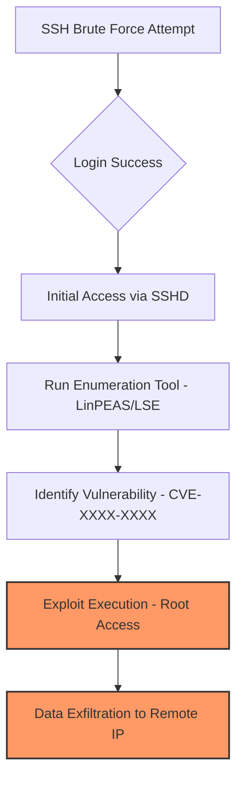

# Incident Analysis: Project "Paranoid" - Linux Privilege Escalation (BTLO)

## 1. Executive Summary
本レポートは、Blue Team Labs Online (BTLO) のチャレンジ「Paranoid」における、Linux Audit Log (`audit.log`) の解析結果をまとめたものである。攻撃者はSSH経由でのBrute Force攻撃によって初期アクセスを獲得し、内部探索を経て既知の脆弱性（CVE）を悪用することでroot権限を奪取、最終的に機密ファイルを外部へ流出させた。

---

## 2. Technical Investigation (Audit Log Analysis)

### Phase 1: Initial Access & Reconnaissance
* **Compromised Account:** 侵害されたユーザーアカウントを特定。
* **Attack Vector:** **SSH Brute Force (T1110)**。`audit.log` 内の `comm=sshd` および大量のログイン試行ログから特定。
* **Attacker Infrastructure:** 外部からの接続元IPアドレスを特定。

### Phase 2: System Enumeration
* **Exploited Tools:** システム探索（Enumeration）に使用された自動化ツール（**LinPEAS**等）を特定。
* **Evidence:** `grep` や `sed` コマンドが、人間には不可能な速度で数百回実行され、システム設定や脆弱なポリシーを執拗に検索しているプロセスパターンを確認。

### Phase 3: Privilege Escalation (PrivEsc)
* **Exploit Mechanism:** root権限奪取に直接使用された特定のバイナリ名およびプロセスID（PID）を特定。
* **Vulnerability Identification:** 悪用された特定の **CVE番号** を特定。
* **Vulnerability Type:** 当該CVEが、特定のシステムコンポーネントの不備を突く **Privilege Escalation（権限昇格）** であることを確認。

### Phase 4: Impact & Exfiltration
* **Target Data:** root権限取得後、攻撃者によって外部サーバーへ送信（流出）された具体的なファイルを特定。

---

## 3. Attack Chain Visualization (Mermaid)

---

## 4. SOC Perspective & Mitigation Strategy
🚩 Detection Strategy
Brute Force Detection: 同一IPからの短時間かつ大量のログイン失敗と、その後の成功イベント（type=USER_LOGIN）を相関分析し、即座にフラグを立てる。

Anomalous Binary Execution: /usr/bin/sudo や脆弱性のあるバイナリが、通常とは異なるUID（0: root）で、かつ予期しない親プロセスから実行された際の検知ルールを策定。

🛡️ Incident Response (SOP)
Network Containment: 攻撃元のIPアドレスを境界防御（Firewall/WAF）で遮断。

Host Isolation: 権限昇格が確認されたホストを即座にネットワークから隔離し、被害の拡大（横展開）を防止。

Credential Reset: 侵害されたアカウントおよび、関連する可能性のある特権アカウントのパスワード変更を実施。

---
Author: Sakata Kyosuke　　

Date: April 1, 2026　　

Investigation Level: Intermediate　　

Artifacts: Linux Audit Logs, OSINT (CVE Databases)
