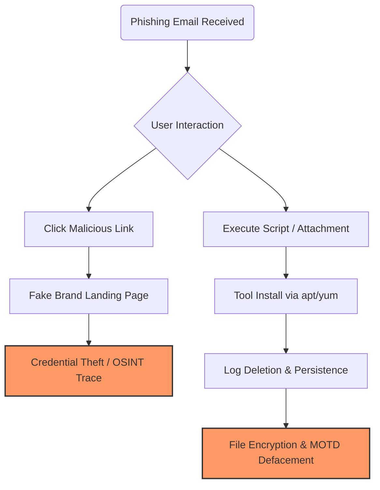

# Incident Analysis: Ransomware Script & Phishing Investigation

## 1. Executive Summary
本レポートは、2026年3月31日に実施した2件のセキュリティ解析（ランサムウェア・スクリプトおよびフィッシングメール）
の結果をまとめたものである。
Linuxシステムを標的とした暗号化準備挙動と、SNSアカウントまで紐付けられた高度ななりすましメールの双方を解析し、
攻撃者のインフラおよび手法（TTPs）を特定した。

---

## 2. Case 01: Malware Analysis - Ransomware Script

### 📂 Scenario
ファイル暗号化実行前に回収された不審なシェルスクリプトの静的解析。

### 🔍 Technical Findings
*   **C2 Infrastructure:** 
    *   スクリプト内で複数回参照される悪意のあるIPアドレスを特定。
    *   C2サーバー上のテキストファイルを参照して実行可否を判断するチェック用URLを特定。
*   **Defense Evasion & Anti-Forensics:** 
    *   パッケージマネージャー（`apt-get`, `yum`）を悪用した攻撃ツールの自動インストール手順を確認。
    *   調査を困難にするため、インストール後に `yum` ログを削除するコマンドラインを特定。
*   **Persistence & Impact:**
    *   **MOTD Defacement:** `/etc/motd` を改ざんし、システムログイン時に脅迫文を表示させる設定を確認。
    *   **Encryption Logic:** `encrypt` で始まる5つの主要関数と、暗号化後に付与される独自の拡張子を特定。

---

## 3. Case 02: Phishing Analysis 2

### 📂 Scenario
特定の企業を装ったフィッシングメール（.eml）のフォレンジック解析。

### 🔍 Technical Findings
*   **Email Forensics:** 
    *   送信元・受信者アドレス、送信日時、および本文のエンコード方式を特定。
*   **Brand Impersonation:** 
    *   なりすまし対象の企業ロゴを外部から取得するために使用されたURLを特定。
*   **Visual Analysis (URL2PNG):** 
    *   行動喚起（CTA）ボタンのリンク先を安全に視覚化。ランディングページの冒頭文から、認証情報窃取の意図を確認。
*   **OSINT Activity:** 
    *   URLパラメータに含まれていたFacebookプロフィールのURLを発見。関連する攻撃者アカウント名を特定。

---

## 4. Attack Chain Visualization

---

## 5. SOC Perspective & Recommendations
今回の2事案は、ソーシャルエンジニアリングを起点とした多段階攻撃の典型例である。

Endpoint Strategy: パッケージマネージャーの異常な親プロセス（Webサーバ等）からの実行や、
システムログ（/var/log/yum.log等）の削除挙動をSIEMで検知対象とする。

Intelligence Strategy: フィッシングサイトに関連付けられたSNSアカウント等のOSINT情報をブラックリストへ反映し、
相関分析に活用する。
