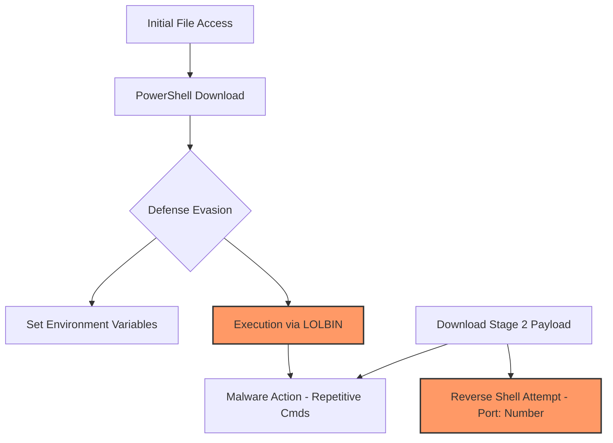

# Incident Analysis: Endpoint Investigation via Sysmon Logs (BTLO)

## 1. Executive Summary
本レポートは、Blue Team Labs Online (BTLO) におけるSysmonログ解析チャレンジの結果をまとめたものである。
Windows標準ツール（LOLBIN）を悪用したマルウェアのダウンロード、環境変数の操作、およびリバースシェル確立の試行を特定した。
標準プロセスを隠れ蓑にする攻撃手法（Living off the Land）に対し、プロセスツリーとネットワーク接続の両面から解析を実施した。

---

## 2. Technical Investigation (Sysmon Log Analysis)

### Phase 1: Execution & Initial Download
Sysmon Event ID 1 (Process Creation) および ID 3 (Network Connection) を中心に解析。
*   **Initial Vector:** 攻撃者にアクセス権を与えた特定のファイルを特定。
*   **Malicious Download:** `powershell.exe` の特定の **cmdlet** を使用し、外部ポート（Port: [Number]）を介して検体をダウンロードした痕跡を確認。

### Phase 2: Defense Evasion & Malware Activity
攻撃者は検知回避のためにWindows標準機能を巧みに利用。
*   **LOLBIN Utilization:** 悪意のあるコマンド実行の踏み台（Living off the Land Binaries）として使用された標準プロセスを特定。
*   **Environment Manipulation:** 攻撃者によって設定された独自の環境変数を特定。
*   **Malware Analysis:** 
    *   マルウェアの記述言語：[Language]
    *   挙動：同一の悪意あるコマンドを複数回実行するループ処理を確認。

### Phase 3: C2 Establishment Attempt
*   **Secondary Payload:** マルウェア実行後、さらに追加ファイルをダウンロード。通信ログより完全なURL（Full URL）を特定。
*   **Reverse Shell:** 攻撃者がリバースシェルの確立を試みた待機ポート（Port: [Number]）を特定。

---

## 3. Attack Chain Visualization

